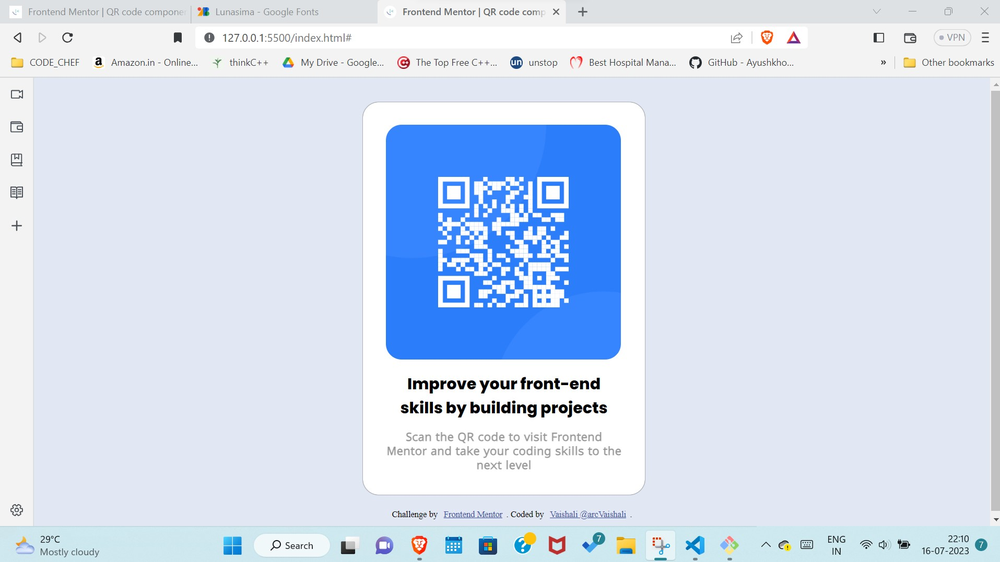

# Frontend Mentor - QR code component solution

This is a solution to the [QR code component challenge on Frontend Mentor](https://www.frontendmentor.io/challenges/qr-code-component-iux_sIO_H). Frontend Mentor challenges help you improve your coding skills by building realistic projects. 

## Table of contents

- [Overview](#overview)
  - [Screenshot](#screenshot)
  - [Links](#links)
- [My process](#my-process)
  - [Built with](#built-with)
  - [What I learned](#what-i-learned) 
- [Author](#author)

## Overview

### Screenshot

### Links

- Solution URL: [My QR Code Scanner](https://github.com/arcVaishali/qr-code-component-main)
- Live Site URL: [My QR Code Scanner](https://arcvaishali.github.io/qr-code-component-main/)

## My process

### Built with

- Semantic HTML5 markup
- CSS custom properties
<!-- - Flexbox
- CSS Grid
- Mobile-first workflow
- [React](https://reactjs.org/) - JS library
- [Next.js](https://nextjs.org/) - React framework
- [Styled Components](https://styled-components.com/) - For styles -->

### What I learned

Using various display properties, google font and other basic HTML and CSS concepts.

## Author

- Frontend Mentor - [@arcVaishali](https://www.frontendmentor.io/profile/arcVaishali)
- Twitter - [@Vaishali_P14](https://www.twitter.com/Vaishali_P14)

